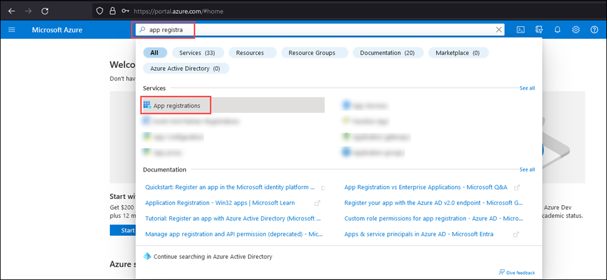
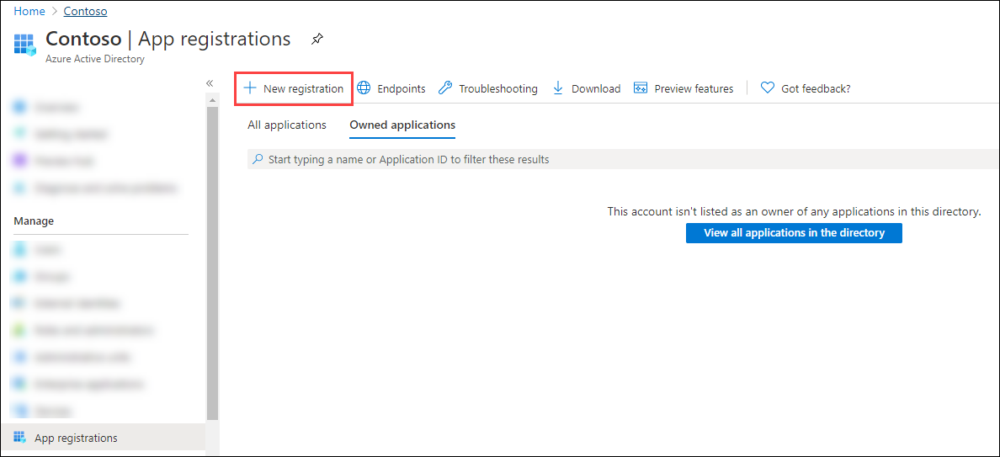
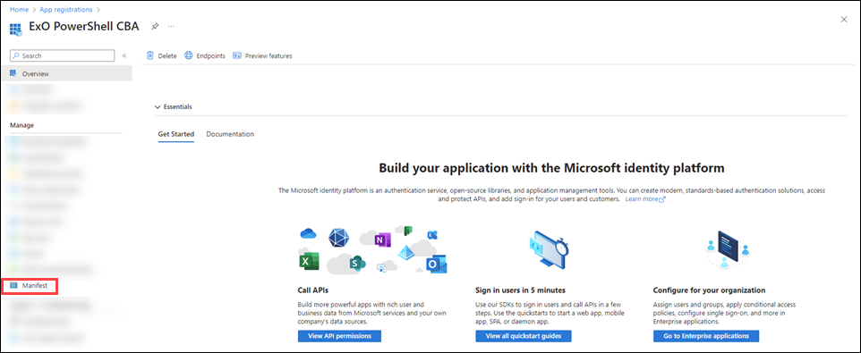
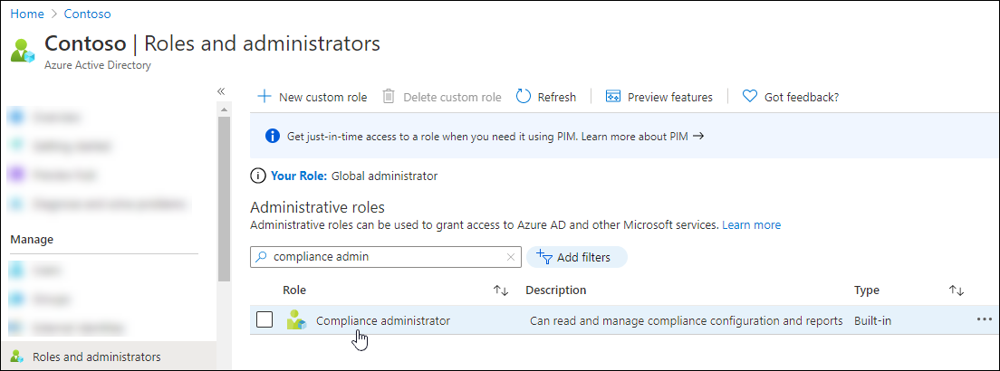
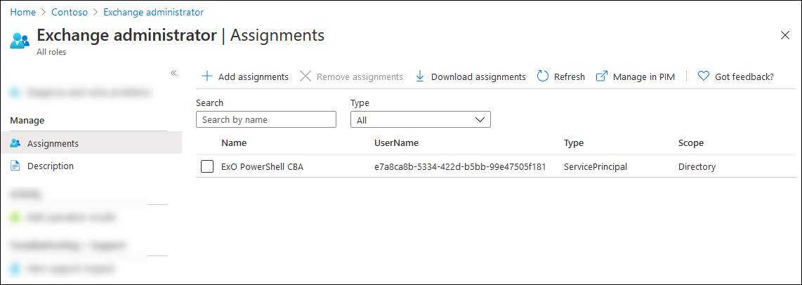

# App-only authentication for unattended scripts in Exchange Online PowerShell and Security & Compliance PowerShell

Auditing and reporting scenarios in Microsoft 365 often involve unattended scripts in Exchange Online PowerShell and Security & Compliance PowerShell. In the past, unattended sign in required you to store the username and password in a local file or in a secret vault that's accessed at run-time. But, as we all know, storing user credentials locally is not a good security practice.

Certificate based authentication (CBA) or app-only authentication as described in this article supports unattended script and automation scenarios by using Azure AD apps and self-signed certificates.

> [!NOTE]
>
> - Did you know that you can connect to Exchange Online PowerShell using managed identities in Azure? Check out [Use Azure managed identities to connect to Exchange Online PowerShell](connect-exo-powershell-managed-identity.md).
>
> - The features and procedures described in this article require the following versions of the Exchange Online PowerShell module:
>   - **Exchange Online PowerShell (Connect-ExchangeOnline)**: Version 2.0.3 or later.
>   - **Security & Compliance PowerShell (Connect-IPPSSession)**: Version 2.0.6-Preview5 or later.
>
>   For instructions on how to install or update the module, see [Install and maintain the Exchange Online PowerShell module](exchange-online-powershell-v2.md#install-and-maintain-the-exchange-online-powershell-module). For instructions on how to use the module in Azure automation, see [Manage modules in Azure Automation](/azure/automation/shared-resources/modules).
>
> - Version 2.0.5 and earlier is known as the Exchange Online PowerShell V2 module (abbreviated as the EXO V2 module). Version 3.0.0 and later is known as the Exchange Online PowerShell V3 module (abbreviated as the EXO V3 module).
>
> - In Exchange Online PowerShell, you can't use the procedures in this article with the following Microsoft 365 Group cmdlets:
>   - [New-UnifiedGroup](/powershell/module/exchange/new-unifiedgroup)
>   - [Remove-UnifiedGroup](/powershell/module/exchange/remove-unifiedgroup)
>   - [Set-UnifiedGroup](/powershell/module/exchange/set-unifiedgroup)
>   - [Remove-UnifiedGroupLinks](/powershell/module/exchange/remove-unifiedgrouplinks)
>   - [Add-UnifiedGroupLinks](/powershell/module/exchange/add-unifiedgrouplinks)
>
>   You can use Microsoft Graph to replace most of the functionality from those cmdlets. For more information, see [Working with groups in Microsoft Graph](/graph/api/resources/groups-overview).
>
> - In Security & Compliance PowerShell, you can't use the procedures in this article with the following cmdlets:
>   - [Get-ComplianceCase](/powershell/module/exchange/get-compliancecase)
>   - [Get-CaseHoldPolicy](/powershell/module/exchange/get-caseholdpolicy)
>
> - App-only authentication does not support delegation. Unattended scripting in delegation scenarios is supported with the Secure App Model. For more information, go [here](/powershell/partnercenter/multi-factor-auth#exchange).

## How does it work?

The Exchange Online PowerShell module uses the Active Directory Authentication Library to fetch an app-only token using the application Id, tenant Id (organization), and certificate thumbprint. The application object provisioned inside Azure AD has a Directory Role assigned to it, which is returned in the access token. The session's role based access control (RBAC) is configured using the directory role information that's available in the token.

## Connection examples

The following examples show how to use the Exchange Online PowerShell module with app-only authentication:

> [!IMPORTANT]
> In the following connection commands, use the primary `.onmicrosoft.com` domain for your organization as the value of the _Organization_ parameter.
>
> The following connection commands have many of the same options available as described in [Connect to Exchange Online PowerShell](connect-to-exchange-online-powershell.md) and [Connect to Security & Compliance PowerShell](connect-to-scc-powershell.md). For example:
>
> - In Exchange Online PowerShell using the EXO V3 module, you can omit or include the _UseRPSSession_ switch to use REST API cmdlets or original remote PowerShell cmdlets. For more information, see [Updates for version 3.0.0 (the EXO V3 module)](exchange-online-powershell-v2.md#updates-for-version-300-the-exo-v3-module).
>
> - Microsoft 365 GCC High or Microsoft 365 DoD environments require the following additional parameters and values:
>   - **Connect-ExchangeOnline in GCC High**: `-ExchangeEnvironmentName O365USGovGCCHigh`.
>   - **Connect-IPPSSession in GCC High**: `-ConnectionUri https://ps.compliance.protection.office365.us/powershell-liveid/ -AzureADAuthorizationEndpointUri https://login.microsoftonline.us/common`.
>   - **Connect-ExchangeOnline in DoD**: `-ExchangeEnvironmentName O365USGovDoD`.
>   - **Connect-IPPSSession in DoD**: `-ConnectionUri https://l5.ps.compliance.protection.office365.us/powershell-liveid/ -AzureADAuthorizationEndpointUri https://login.microsoftonline.us/common`.
>
> - If a **Connect-IPPSSession** command present a login prompt, run the command: `$Global:IsWindows = $true` before the **Connect-IPPSSession** command.

- **Connect using a certificate thumbprint**:

  The certificate needs to be installed on the computer where you're running the command. The certificate should be installed in the user certificate store.

  - <u>Exchange Online PowerShell</u>:

    ```powershell
    Connect-ExchangeOnline -CertificateThumbPrint "012THISISADEMOTHUMBPRINT" -AppID "36ee4c6c-0812-40a2-b820-b22ebd02bce3" -Organization "contosoelectronics.onmicrosoft.com"
    ```

  - <u>Security & Compliance PowerShell</u>:

    ```powershell
    Connect-IPPSSession -CertificateThumbPrint "012THISISADEMOTHUMBPRINT" -AppID "36ee4c6c-0812-40a2-b820-b22ebd02bce3" -Organization "contosoelectronics.onmicrosoft.com"
    ```

- **Connect using a certificate object**:

  The certificate does not need to be installed on the computer where you're running the command. You can store the certificate object remotely. The certificate is fetched when the script is run.

  - <u>Exchange Online PowerShell</u>:

    ```powershell
    Connect-ExchangeOnline -Certificate <%X509Certificate2 Object%> -AppID "36ee4c6c-0812-40a2-b820-b22ebd02bce3" -Organization "contosoelectronics.onmicrosoft.com"
    ```

  - <u>Security & Compliance PowerShell</u>:

    ```powershell
    Connect-IPPSSession -Certificate <%X509Certificate2 Object%> -AppID "36ee4c6c-0812-40a2-b820-b22ebd02bce3" -Organization "contosoelectronics.onmicrosoft.com"
    ```

- **Connect using a local certificate**:

  > [!NOTE]
  > Using a **ConvertTo-SecureString** command to store the password of the certificate locally defeats the purpose of a secure connection method for automation scenarios. Using a **Get-Credential** command to prompt you for the password of the certificate securely isn't ideal for automation scenarios. In other words, there's really no automated _and_ secure way to connect using a local certificate.

  - <u>Exchange Online PowerShell</u>:

    ```powershell
    Connect-ExchangeOnline -CertificateFilePath "C:\Users\navin\Desktop\automation-cert.pfx" -CertificatePassword (Get-Credential).password -AppID "36ee4c6c-0812-40a2-b820-b22ebd02bce3" -Organization "contosoelectronics.onmicrosoft.com"
    ```

  - <u>Security & Compliance PowerShell</u>:

     ```powershell
    Connect-IPPSSession -CertificateFilePath "C:\Users\navin\Desktop\automation-cert.pfx" -CertificatePassword (Get-Credential).password -AppID "36ee4c6c-0812-40a2-b820-b22ebd02bce3" -Organization "contosoelectronics.onmicrosoft.com"
    ```

## Set up app-only authentication

An initial onboarding is required for authentication using application objects. Application and service principal are used interchangeably, but an application is like a class object while a service principal is like an instance of the class. You can learn more about this at [Application and service principal objects in Azure Active Directory](/azure/active-directory/develop/app-objects-and-service-principals).

For a detailed visual flow about creating applications in Azure AD, see <https://aka.ms/azuread-app>.

1. [Register the application in Azure AD](#step-1-register-the-application-in-azure-ad).

2. [Assign API permissions to the application](#step-2-assign-api-permissions-to-the-application).

   An application object has the default permission `User.Read`. For the application object to access resources, it needs to have the Application permission `Exchange.ManageAsApp`.

3. [Generate a self-signed certificate](#step-3-generate-a-self-signed-certificate)

   - For app-only authentication in Azure AD,  you typically use a certificate to request access. Anyone who has the certificate and its private key can use the app, and the permissions granted to the app.

   - Create and configure a self-signed X.509 certificate, which will be used to authenticate your Application against Azure AD, while requesting the app-only access token.

   - This is similar to generating a password for user accounts. The certificate can be self-signed as well. See the [Appendix](#step-3-generate-a-self-signed-certificate) section later in this article for instructions for generating certificates in PowerShell.

     > [!NOTE]
     > Cryptography: Next Generation (CNG) certificates are not supported for app-only authentication with Exchange. CNG certificates are created by default in modern Windows versions. You must use a certificate from a CSP key provider. The [Appendix](#step-3-generate-a-self-signed-certificate) section covers two supported methods to create a CSP certificate.

4. [Attach the certificate to the Azure AD application](#step-4-attach-the-certificate-to-the-azure-ad-application)

5. [Assign Azure AD roles to the application](#step-5-assign-azure-ad-roles-to-the-application)

   The application needs to have the appropriate RBAC roles assigned. Because the apps are provisioned in Azure AD, you can use any of the supported built-in roles.

### Step 1: Register the application in Azure AD

> [!NOTE]
> If you encounter problems, check the [required permissions](/azure/active-directory/develop/howto-create-service-principal-portal#required-permissions) to verify that your account can create the identity.

1. Open the Azure AD portal at <https://portal.azure.com/>.

2. In the **Search** box at the top of the page, start typing **App registrations**, and then select **App registrations** from the results in the **Services** section.

   

   Or, to go directly to the **App registrations** page, use <https://portal.azure.com/#view/Microsoft_AAD_IAM/ActiveDirectoryMenuBlade/~/RegisteredApps>.

3. On the **App registrations** page, click **New registration**.

   

   On the **Register an application** page that opens, configure the following settings:

   - **Name**: Enter something descriptive. For example, ExO PowerShell CBA.

   - **Supported account types**: Verify that **Accounts in this organizational directory only (\<YourOrganizationName\> only - Single tenant)** is selected.

   - **Redirect URI (optional)**: In the first box, verify that **Web** is selected. In the second box, enter the URI where the access token is sent.

     Note that you can't create credentials for [native applications](/azure/active-directory/manage-apps/application-proxy-configure-native-client-application), because you can't use that type for automated applications.

     

   When you're finished, click **Register**.

4. Leave the app page that you return to open. You'll use it in the next step.

### Step 2: Assign API permissions to the application

> [!NOTE]
> The procedures in this section replace any default permissions that were automatically configured for the new app. The app doesn't need the default permissions that were replaced.

1. On the app page under **Management**, select **Manifest**.

   

2. On the **Manifest** page that opens, find the `requiredResourceAccess` entry (on or about line 47).

   Modify the `resourceAppId`, `resourceAccess id`, and `resourceAccess type` values as shown in the following code snippet:

   ```json
   "requiredResourceAccess": [
      {
         "resourceAppId": "00000002-0000-0ff1-ce00-000000000000",
         "resourceAccess": [
            {
               "id": "dc50a0fb-09a3-484d-be87-e023b12c6440",
               "type": "Role"
            }
         ]
      }
   ],
   ```

   When you're finished, click **Save**.

3. Still on the **Manifest** page, under **Management**, select **API permissions**.

   

   On the **API permissions** page that opens, do the following steps:

   - **API / Permissions name**: Verify the value **Exchange.ManageAsApp** is shown.

     > [!NOTE]
     > If necessary, search for **Office 365 Exchange** under **APIs my organization uses** on the **Request API Permissions** page.

   - **Status**: The current incorrect value is **Not granted for \<Organization\>**, and this value needs to be changed.

     

     Select **Grant admin consent for \<Organization\>**, read the confirmation dialog that opens, and then click **Yes**.

     The **Status** value should now be **Granted for \<Organization\>**.

     

4. Close the current **API permissions** page (not the browser tab) to return to the **App registrations** page. You'll use it in an upcoming step.

### Step 3: Generate a self-signed certificate

Create a self-signed x.509 certificate using one of the following methods:

- (Recommended) Use the [New-SelfSignedCertificate](/powershell/module/pki/new-selfsignedcertificate), [Export-Certificate](/powershell/module/pki/export-certificate) and [Export-PfxCertificate](/powershell/module/pki/export-pfxcertificate) cmdlets in an elevated (run as administrator) Windows PowerShell session to request a self-signed certificate and export it to `.cer` and `.pfx` (SHA1 by default). For example:

  ```powershell
  # Create certificate
  $mycert = New-SelfSignedCertificate -DnsName "contoso.org" -CertStoreLocation "cert:\CurrentUser\My" -NotAfter (Get-Date).AddYears(1) -KeySpec KeyExchange

  # Export certificate to .pfx file
  $mycert | Export-PfxCertificate -FilePath mycert.pfx -Password (Get-Credential).password

  # Export certificate to .cer file
  $mycert | Export-Certificate -FilePath mycert.cer
  ```

- Use the [Create-SelfSignedCertificate script](https://github.com/SharePoint/PnP-Partner-Pack/blob/master/scripts/Create-SelfSignedCertificate.ps1) script to generate SHA1 certificates.

  ```powershell
  .\Create-SelfSignedCertificate.ps1 -CommonName "MyCompanyName" -StartDate 2021-01-06 -EndDate 2022-01-06
  ```

### Step 4: Attach the certificate to the Azure AD application

After you register the certificate with your application, you can use the private key (`.pfx` file) or the thumbprint for authentication.

1. On the **Owned applications** tab on the **Apps registration** page from the end of [Step 2](#step-2-assign-api-permissions-to-the-application), select your application.

   If you need to get back to **Apps registration** page, use <https://portal.azure.com/#view/Microsoft_AAD_IAM/ActiveDirectoryMenuBlade/~/RegisteredApps>, verify the **Owned applications** tab is selected, and then select your application.

   

2. On the application page that opens, under **Manage**, select **Certificates & secrets**.

   

3. On the **Certificates & secrets** page that opens, click **Upload certificate**.

   

   In the dialog that opens, browse to the self-signed certificate (`.cer` file) that you created in [Step 3](#step-3-generate-a-self-signed-certificate).

   

   When you're finished, click **Add**.

   The certificate is now shown in the **Certificates** section.

   

4. Close the current **Certificates & secrets** page, and then the **App registrations** page to return to the main <https://portal.azure.com/> page. You'll use it in the next step.

### Step 5: Assign Azure AD roles to the application

You have two options:

- **Assign Azure AD roles to the application**: This method is supported in Exchange Online PowerShell and Security & Compliance PowerShell.
- **Assign custom Exchange Online role groups to the application**: Currently, this method is supported only in Exchange Online PowerShell, and only when you connect in [REST API mode](exchange-online-powershell-v2.md#updates-for-version-300-the-exo-v3-module) (don't use the _UseRPSSession_ switch in the **Connect-ExchangeOnline** command).

> [!NOTE]
> You can also combine both methods to assign permissions. Like using Azure AD roles for the "Exchange Recipient Administrator" role and assign your custom RBAC role to extend the permissions.

#### Assign Azure AD roles to the application

The supported Azure AD roles are described in the following table:

|Role|Exchange Online<br>PowerShell|Security & Compliance<br>PowerShell|
|---|:---:|:---:|
|[Compliance Administrator](/azure/active-directory/roles/permissions-reference#compliance-administrator)|✔|✔|
|[Exchange Administrator](/azure/active-directory/roles/permissions-reference#exchange-administrator)<sup>\*</sup>|✔||
|[Exchange Recipient Administrator](/azure/active-directory/roles/permissions-reference#exchange-recipient-administrator)|✔||
|[Global Administrator](/azure/active-directory/roles/permissions-reference#global-administrator)<sup>\*</sup>|✔|✔|
|[Global Reader](/azure/active-directory/roles/permissions-reference#global-reader)|✔|✔|
|[Helpdesk Administrator](/azure/active-directory/roles/permissions-reference#helpdesk-administrator)|✔||
|[Security Administrator](/azure/active-directory/roles/permissions-reference#security-administrator)<sup>\*</sup>|✔|✔|
|[Security Reader](/azure/active-directory/roles/permissions-reference#security-reader)|✔|✔|

> <sup>\*</sup> The Global Administrator and Exchange Administrator roles provide the required permissions for any task in Exchange Online PowerShell. For example:
>
> - Recipient management.
> - Security and protection features. For example, anti-spam, anti-malware, anti-phishing, and the associated reports.
>
> The Security Administrator role does not have the necessary permissions for those same tasks.

For general instructions about assigning roles in Azure AD, see [View and assign administrator roles in Azure Active Directory](/azure/active-directory/roles/manage-roles-portal).

> [!NOTE]
> The following steps are slightly different for Exchange Online PowerShell vs. Security & Compliance PowerShell. The steps for both environments are shown. To configure roles for both environments, repeat the steps in this section.

1. In Azure AD portal at <https://portal.azure.com/>, start typing **roles and administrators** in the **Search** box at the top of the page, and then select **Azure AD roles and administrators** from the results in the **Services** section.

   

   Or, to go directly to the **Azure AD roles and administrators** page, use <https://portal.azure.com/#view/Microsoft_AAD_IAM/AllRolesBlade>.

2. On the **Roles and administrators** page that opens, find and select one of the supported roles by _clicking on the name of the role_ (not the check box) in the results.

   - **Exchange Online PowerShell**: For example, find and select the **Exchange administrator** role.

     

   - **Security & Compliance PowerShell**: For example, find and select the **Compliance Administrator** role.

     

3. On the **Assignments** page that opens, click **Add assignments**.

   - **Exchange Online PowerShell**:

     

   - **Security & Compliance PowerShell**:

     

4. In the **Add assignments** flyout that opens, find and select the app that you created in [Step 1](#step-1-register-the-application-in-azure-ad).

   

   When you're finished, click **Add**.

5. Back on the **Assignments** page, verify that the role has been assigned to the app.

   - **Exchange Online PowerShell**:

     

   - **Security & Compliance PowerShell**:

     

#### Assign custom Exchange Online role groups to the application

> [!NOTE]
> Remember, this method is supported only in Exchange Online PowerShell, and only when you connect in [REST API mode](exchange-online-powershell-v2.md#updates-for-version-300-the-exo-v3-module) (don't use the _UseRPSSession_ switch in the **Connect-ExchangeOnline** command).

For information about creating custom role groups, see [Create role groups](/exchange/permissions-exo/role-groups#create-role-groups). The custom role group that you assign to the application can contain any combination of built-in and custom roles.

To assign custom Exchange Online role groups to the application, do the following steps:

1. In [Azure Active Directory PowerShell for Graph](/powershell/azure/active-directory/install-adv2), run the following command to store the details of the Azure application that you registered in [Step 1](#step-1-register-the-application-in-azure-ad) in a variable:

   ```powershell
   $<VariableName1> = Get-AzureADServicePrincipal -SearchString "<AppName>"
   ```

   For example:

   ```powershell
   $AADApp = Get-AzureADServicePrincipal -SearchString "ExO PowerShell CBA"
   ```

   For detailed syntax and parameter information, see [Get-AzureADServicePrincipal](/powershell/module/azuread/get-azureadserviceprincipal).

2. In the same PowerShell window, connect to [Exchange Online PowerShell](connect-to-exchange-online-powershell.md) and run the following commands to:
   - Create an Exchange Online service principal object for the Azure application.
   - Store the details of the service principal in a variable.

   ```powershell
   New-ServicePrincipal -AppId $<VariableName1>.AppId -ServiceId $<VariableName1>.ObjectId -DisplayName "<Descriptive Name>"

   $<VariableName2> = Get-ServicePrincipal -Identity "<Descriptive Name>"
   ```

   For example:

   ```powershell
   New-ServicePrincipal -AppId $AADApp.AppId -ServiceId $AADApp.ObjectId -DisplayName "SP for Azure App ExO PowerShell CBA"

   $SP = Get-ServicePrincipal -Identity "SP for Azure App ExO PowerShell CBA"
   ```

   For detailed syntax and parameter information, see [New-ServicePrincipal](/powershell/module/exchange/new-serviceprincipal).

3. In Exchange Online PowerShell, run the following command to add the service principal as a member of the custom role group:

   ```powershell
   Add-RoleGroupMember -Identity "<CustomRoleGroupName>" -Member <$<VariableName2>.Identity | $<VariableName2>.ServiceId | $<VariableName2>.Id>
   ```

   For example:

   ```powershell
   Add-RoleGroupMember -Identity "Contoso View-Only Recipients" -Member $SP.Identity
   ```

   For detailed syntax and parameter information, see [Add-RoleGroupMember](/powershell/module/exchange/add-rolegroupmember).
