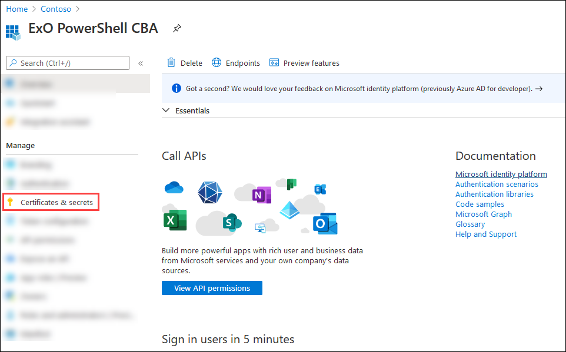
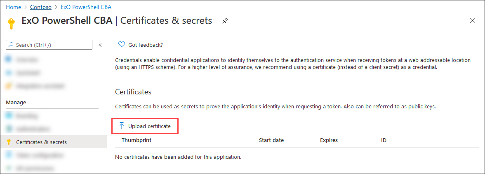

# App-only authentication for unattended scripts in the EXO V2 module

> [!NOTE]
> The required `2.0.3` version of the EXO V2 module for this feature is now Generally Available. For instructions on how to install or update to this version of the module, see [Install and maintain the EXO V2 module](exchange-online-powershell-v2.md#install-and-maintain-the-exo-v2-module).

Auditing and reporting scenarios in Exchange Online often involve scripts that run unattended. In most cases, these unattended scripts access Exchange Online PowerShell using Basic authentication (a username and password). Even when the connection to Exchange Online PowerShell uses modern authentication, the credentials are stored in a local file or a secret vault that's accessed at run-time.

Because storing user credentials locally is not a safe practice, we're releasing this feature to support authentication for unattended scripts (automation) scenarios using AzureAD applications and self-signed certificates.

The following examples show how to use the Exchange Online PowerShell V2 module with app-only authentication:

- Connect using a local certificate:

  ```powershell
  Connect-ExchangeOnline -CertificateFilePath "C:\Users\johndoe\Desktop\automation-cert.pfx" -CertificatePassword (ConvertTo-SecureString -String "<MyPassword>" -AsPlainText -Force) -AppID "36ee4c6c-0812-40a2-b820-b22ebd02bce3" -Organization "contosoelectronics.onmicrosoft.com"
  ```

- Connect using a certificate thumbprint:

  ```powershell
  Connect-ExchangeOnline -CertificateThumbPrint "012THISISADEMOTHUMBPRINT" -AppID "36ee4c6c-0812-40a2-b820-b22ebd02bce3" -Organization "contosoelectronics.onmicrosoft.com"
  ```

  When you use the _CertificateThumbPrint_ parameter, the certificate needs to be installed on the computer where you are running the command. The certificate should be installed in the user certificate store.

- Connect using a certificate object:

  ```powershell
  Connect-ExchangeOnline -Certificate <%X509Certificate2 Object%> -AppID "36ee4c6c-0812-40a2-b820-b22ebd02bce3" -Organization "contosoelectronics.onmicrosoft.com"
  ```

  When you use the _Certificate_ parameter, the certificate does not need to be installed on the computer where you are running the command. This parameter is applicable for scenarios where the certificate object is stored remotely and fetched at runtime during script execution.

> [!TIP]
>
> - In the **Connect-ExchangeOnline** commands, be sure to use an `.onmicrosoft.com` domain in the _Organization_ parameter value. Otherwise, you might encounter cryptic permission issues when you run commands in the app context.
>
> - App-only authentication does not support delegation. Unattended scripting in delegation scenarios is supported with the Secure App Model. For more information, go [here](https://docs.microsoft.com/powershell/partnercenter/multi-factor-auth#exchange).

## How does it work?

The EXO V2 module uses the Active Directory Authentication Library to fetch an app-only token using the application Id, tenant Id (organization), and certificate thumbprint. The application object provisioned inside Azure AD has a Directory Role assigned to it, which is returned in the access token. Exchange Online configures the session RBAC using the directory role information that's available in the token.

## Set up app-only authentication

An initial onboarding is required for authentication using application objects. Application and service principal are used interchangeably, but an application is like a class object while a service principal is like an instance of the class. You can learn more about this at [Application and service principal objects in Azure Active Directory](https://docs.microsoft.com/azure/active-directory/develop/app-objects-and-service-principals).

For a detailed visual flow about creating applications in Azure AD, see <https://aka.ms/azuread-app>.

1. [Register the application in Azure AD](#step-1-register-the-application-in-azure-ad).

2. [Assign Exchange Online API permissions to the application](#step-2-assign-api-permissions-to-the-application).

   An application object has the default permission `User.Read`. For the application object to access Exchange Online resources, it needs to have the Application permission `Exchange.ManageAsApp`.

3. [Generate a self-signed certificate](#step-3-generate-a-self-signed-certificate)

   - For app-only authentication in Azure AD,  you typically use a certificate to request access. Anyone who has the certificate and its private key can use the app, and the permissions granted to the app.

   - Create and configure a self-signed X.509 certificate, which will be used to authenticate your Application against Azure AD, while requesting the app-only access token.

   - This is similar to generating a password for user accounts. The certificate can be self-signed as well. See the [Appendix](#step-3-generate-a-self-signed-certificate) section later in this article for instructions for generating certificates in PowerShell.

     > [!NOTE]
     > Cryptography: Next Generation (CNG) certificates are not supported for app-only authentication with Exchange. CNG certificates are created by default in modern Windows versions. You must use a certificate from a CSP key provider. The [Appendix](#step-3-generate-a-self-signed-certificate) section covers two supported methods to create a CSP certificate.

4. [Step 4: Attach the certificate to the Azure AD application](#step-4-attach-the-certificate-to-the-azure-ad-application)

5. [Assign Azure AD roles to the application](#step-5-assign-azure-ad-roles-to-the-application)

   The application needs to have the appropriate RBAC roles assigned. Because the apps are provisioned in Azure AD, you can use any of the built-in roles. The following roles are supported:

   - Global administrator
   - Compliance administrator
   - Security reader
   - Security administrator
   - Helpdesk administrator
   - Exchange administrator
   - Global Reader

## Appendix

## Step 1: Register the application in Azure AD

**Note**: If you encounter problems, check the [required permissions](https://docs.microsoft.com/azure/active-directory/develop/howto-create-service-principal-portal#required-permissions) to verify that your account can create the identity.

1. Open the Azure AD portal at <https://portal.azure.com/>.

2. Under **Manage Azure Active Directory**, click **View**.

   

3. On the **Overview** page that appears, under **Manage**, select **App registrations**.

   

4. On the **App registrations** that appears, click **New registration**.

   

   On the **Register an application** page that appears, configure the following settings:

   - **Name**: Enter something descriptive. For example, ExO PowerShell CBA.

   - **Supported account types**: Verify that **Accounts in this organizational directory only (\<YourOrganizationName\> only - Single tenant)** is selected.

   - **Redirect URI (optional)**: In the first box, verify that **Web** is selected. In the second box, enter the URI where the access token is sent.

     Note that you can't create credentials for [native applications](https://docs.microsoft.com/azure/active-directory/manage-apps/application-proxy-configure-native-client-application), because you can't use that type for automated applications.

     

   When you're finished, click **Register**.

5. Leave the app page that appears open. You'll use it in the next step.

## Step 2: Assign API permissions to the application

You need to assign the API permission `Exchange.ManageAsApp` so the application can manage Exchange Online. API permissions are required because they have consent flow enabled, which allows auditing (directory roles don't have consent flow).

1. On the app page under **Management**, select **Manifest**.

   

2. On the **Manifest** page that appears, find the `requiredResourceAccess` entry (on or about line 44).

   Modify the `resourceAppId`, `resourceAccess`, `id`, and `type` values as shown in the following code snippet:

   ```json
   "requiredResourceAccess": [
      {
         "resourceAppId": "00000002-0000-0ff1-ce00-000000000000",
         "resourceAccess": [
            {
               "id": "dc50a0fb-09a3-484d-be87-e023b12c6440",
               "type": "Role"
            }
         ]
      }
   ],
   ```

   When you're finished, click **Save**.

3. Still on the **Manifest** page, under **Management**, select **API permissions**.

   

   On the **API permissions** page that appears, do the following steps:

   - **API / Permissions name**: Verify the value **Exchange.ManageAsApp** is shown.

   - **Status**: The current incorrect value is **Not granted for \<Organization\>**, and this value needs to be changed.

     

     Select **Grant admin consent for \<Organization\>**, read the confirmation dialog that appears, and then click **Yes**.

     The **Status** value should now be **Granted for \<Organization\>**.

     

4. Close the current **API permissions** page (not the browser tab) to return to the **App registrations** page. You'll use it in an upcoming step.

## Step 3: Generate a self-signed certificate

Create a self-signed x.509 certificate using one of the following methods:

- (Recommended) Use the [New-SelfSignedCertificate](https://docs.microsoft.com/powershell/module/pkiclient/new-selfsignedcertificate), [Export-Certificate](https://docs.microsoft.com/powershell/module/pkiclient/export-certificate) and [Export-PfxCertificate](https://docs.microsoft.com/powershell/module/pkiclient/export-pfxcertificate) cmdlets in an elevated (run as administrator) Windows PowerShell session to request a self-signed certificate and export it to `.cer` and `.pfx` (SHA1 by default).

  ```powershell
  # Create certificate
  $mycert = New-SelfSignedCertificate -DnsName "contoso.org" -CertStoreLocation "cert:\LocalMachine\My" -NotAfter (Get-Date).AddYears(1) -KeySpec KeyExchange

  # Export certificate to .pfx file
  $mycert | Export-PfxCertificate -FilePath mycert.pfx -Password $(ConvertTo-SecureString -String "P@s$w0rd1234" -AsPlainText -Force)

  # Export certificate to .cer file
  $mycert | Export-Certificate -FilePath mycert.cer
  ```

- Use the [Create-SelfSignedCertificate script](https://github.com/SharePoint/PnP-Partner-Pack/blob/master/scripts/Create-SelfSignedCertificate.ps1) script to generate SHA1 certificates.

  ```powershell
  .\Create-SelfSignedCertificate.ps1 -CommonName "MyCompanyName" -StartDate 2021-01-06 -EndDate 2022-01-06
  ```

## Step 4: Attach the certificate to the Azure AD application

After you register the certificate with your application, you can use the public key (`.pfx` file) or the thumbprint for authentication.

1. On the **Apps registration** page from the end of Step 2, select your application.

   If you need to get back to **Apps registration** page, do the following steps:

   1. Open the Azure AD portal at <https://portal.azure.com/>.
   2. Under **Manage Azure Active Directory**, click **View**.
   3. Under **Manage**, select **App registrations**.

   

2. On the application page that appears, under **Manage**, select **Certificates & secrets**.

   

3. On the **Certificates & secrets** page that appears, click **Upload certificate**.

   

   In the dialog that appears, browse to the self-signed certificate (`.cer` file) that you created in [Step 3](#step-3-generate-a-self-signed-certificate).

   

   When you're finished, click **Add**.

   The certificate is now shown in the **Certificates** section.

   

4. Close the current **Certificates & secrets** page, and then the **App registrations** page to return to the main <https://portal.azure.com/> page. You'll use it in the next step.

## Step 5: Assign Azure AD roles to the application

Azure AD has more than 50 admin roles available. For app-only authentication in Exchange Online, we currently support the previously mentioned roles:

- Global administrator
- Compliance administrator
- Security reader
- Security administrator
- Helpdesk administrator
- Exchange administrator
- Global Reader

For general instructions about assigning roles in Azure AD, see [View and assign administrator roles in Azure Active Directory](https://docs.microsoft.com/azure/active-directory/roles/manage-roles-portal).

1. On the Azure AD portal at <https://portal.azure.com/>, under **Manage Azure Active Directory**, click **View**.

   

2. On the **Overview** page that appears, under **Manage**, select **Roles and administrators**.

   

3. On the **Roles and administrators** page that appears, find and select one of the supported roles by _clicking on the name of the role_ (not the check box) in the results.

   

4. On the **Assignments** page that opens, click **Add assignments**.

   

5. In the **Add assignments** flyout that appears, find and select the app that you created in [Step 1](#step-1-register-the-application-in-azure-ad).


   

   When you're finished, click **Add**.

6. Back on the **Assignments** page, verify that the app has been assigned to the role.

   
